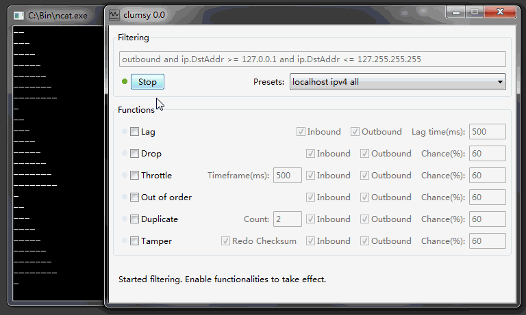

# clumsy

__clumsy makes your network condition on Windows significantly worse, but in a managed and interactive manner.__

Leveraging the awesome [WinDivert](http://reqrypt.org/windivert.html), clumsy stops living network packets and capture them, lag/drop/tamper/.. the packets on demand, then send them away. Whether you want to track down weird bugs related to broken network, or evaluate your application on poor connections, clumsy will come in handy:

* No installation.
* No need for proxy setup or code change in your application.
* System wide network capturing means it works on any application.
* Works even if you're offline (ie, connecting from localhost to localhost).
* Your application keeps running, while clumsy can start and stop anytime.
* Interactive control how bad the network can be, with enough visual feedback to tell you what's going on.

See [this page](http://jagt.github.io/clumsy) for more info and build instructions.

## Details

Simulate network latency, delay, packet loss with clumsy on Windows 10:

In addition, **This fork** implements the **bandwidth limit** for clumsy:

The algorithm is similar to webrtc, which uses a sliding window (size = 1 second) to statistic current bandwidth.

Though nowadays it seems everybody has high speed broadband Internet connection, it's still important to face the fact that network transportation isn't always reliable. You don't want a duplicated UDP packet to crash your application. Properly handle this usually requires adding more code in their projects, and it's not always easy nor possible. Hopefully clumsy can provide an easy and painless (though suboptimal) option to do this for busy developers.

## License

MIT
